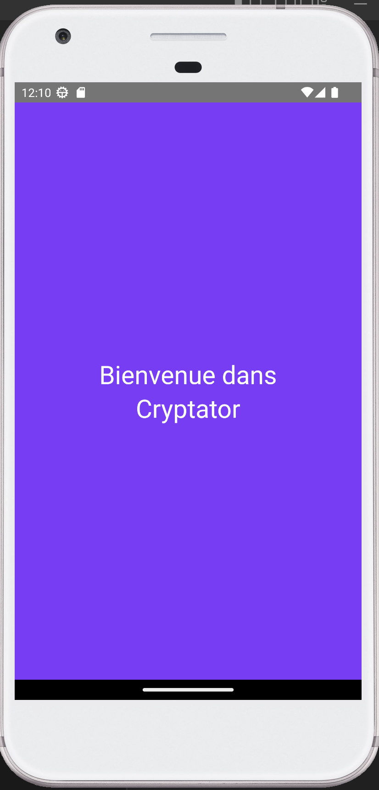
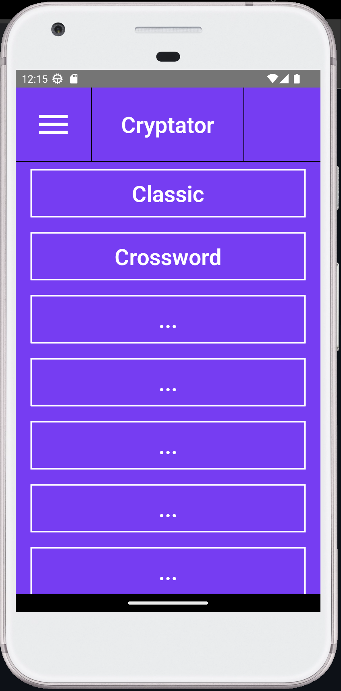
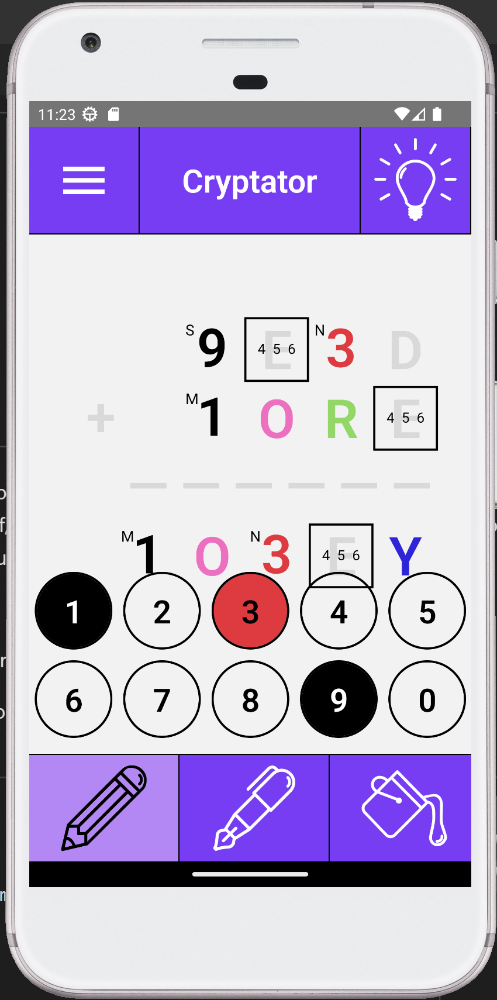

# About this folder

This folder provides an playable interface of the Cryptator project implemented [here](https://github.com/arnaud-m/cryptator) (note that this link provides also all the details about what cryptarithms are and how you can solve them). 

This interface uses the [React Native](https://reactnative.dev/) framework, allowing to run the application both on Android and Apple smartphones. 

# The application structure

- [About this folder](#about-this-folder)
- [The application structure](#the-application-structure)
  - [Welcome screen](#welcome-screen)
  - [The home page](#the-home-page)
  - [Play a game](#play-a-game)
  - [Generate a cryptarithm](#generate-a-cryptarithm)
  - [Create your cryptarithm](#create-your-cryptarithm)
  - [The help panel](#the-help-panel)
  - [Credits](#credits)
- [TODO](#todo)

## Welcome screen

<table>
  <tbody>
    <tr>
      <td>
         
      </td>
      <td>
        From this screen, click anywhere to go into the Home Page of the game
      </td>
    </tr>
  </tbody>
</table>

## The home page

<table>
  <tbody>
    <tr>
      <td>
         
      </td>
      <td>
       In the home page you are able to select how to interact with Cryptarithms. You can play a game, where you can solve a cryptarithm yourself, generate automatically a cryptarithm with existing words coming from different thematic, create your custom cryptarithm and verify its validity.
      </td>
    </tr>
  </tbody>
</table>

## Play a game

<table>
  <tbody>
    <tr>
      <td>
       
      </td>
      <td>
          You are able to solve yourself one of the proposed cryptarithms with the following tools:  
        <ul>
        <li>
           The pencil allowing you to write small annotation on a letter in order to simplify the solution.
        </li>
        <li>
           The pen, allowing you to make an affectation to a letter of the cryptarithm.
        </li>
        <li>
           The bucket, allowing you to color the letters of the cryptarithms to visually help your solving approach.
        </li>
        </ul>
      </td>
    </tr>
  </tbody>
</table>

<!-- -   -->

Note that in the **easy** mode, invalid affectations will appear in red and that the pencil avoid to enter already used numbers.

When the game is finished, a congratulation popup is triggered.

## Generate a cryptarithm

## Create your cryptarithm

## The help panel

## Credits

# TODO

- The app should also be run on a browser (Chrome, Mozzilla, Safari...)
- Add a page to set the cryptarithm config (allow leading zeros, repetitions...)